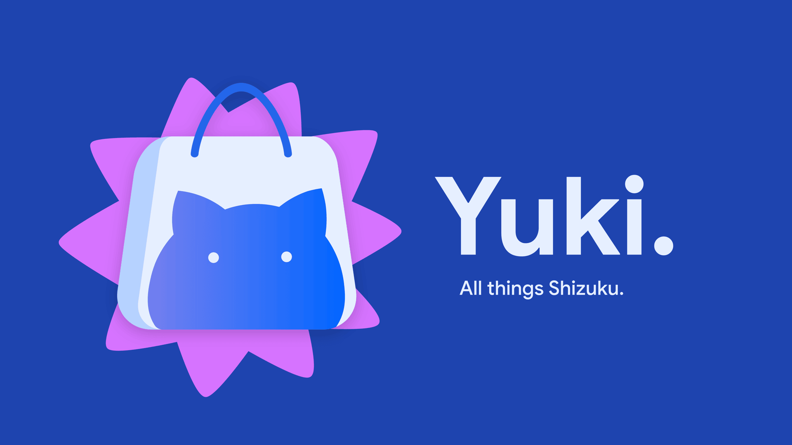
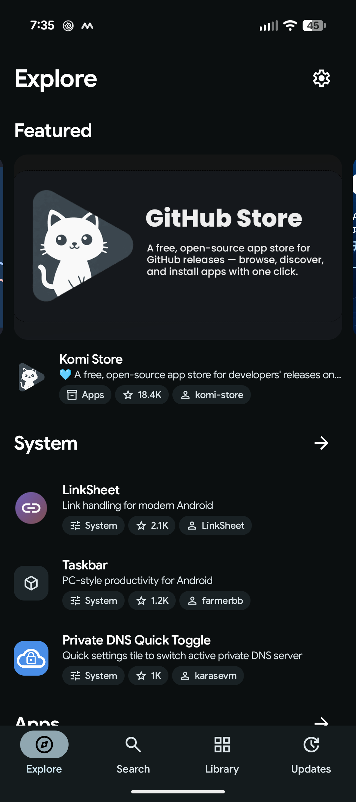
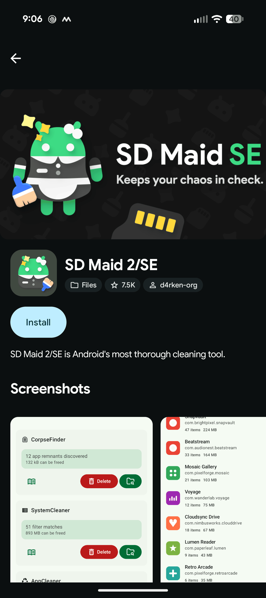
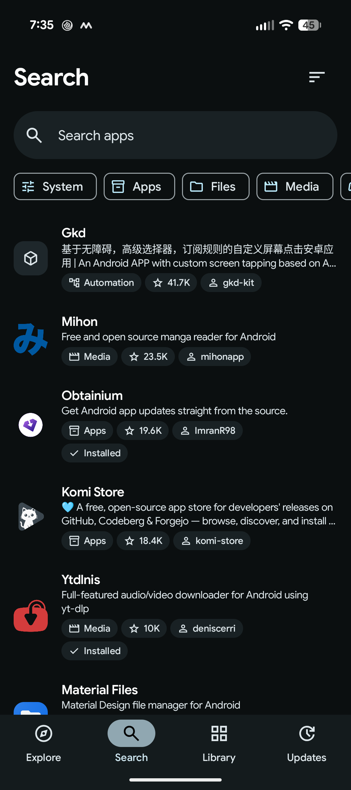
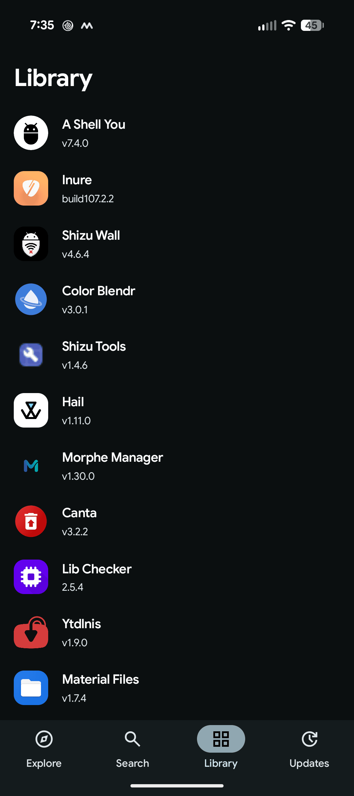
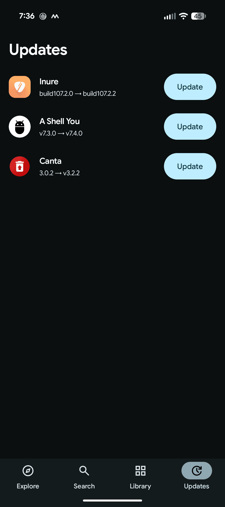

# Yuki

A catalog of open-source Android apps that use the [Shizuku](https://shizuku.rikka.app)
permission framework.

## Download

Download the APK from the [latest release](https://github.com/carlelieser/yuki/releases/latest). Alternatively, you can use [the website](https://yukistore.org), but the Android app is preferred for a better native experience and automatic updates.

## Screenshots

| Explore                                    | Listing                                    | Search                                   | Library                                    | Updates                                    |
| ------------------------------------------ | ------------------------------------------ | ---------------------------------------- | ------------------------------------------ | ------------------------------------------ |
|  |  |  |  |  |

## How it works

Yuki crawls public GitHub repositories and scores them based on the following criteria:

| Evidence                                        | Confidence |
| ----------------------------------------------- | ---------- |
| `rikka.shizuku.ShizukuProvider` in the manifest | Strong     |
| `dev.rikka.shizuku` in a Gradle build file      | Strong     |
| `moe.shizuku.api` in a Gradle build file        | Probable   |
| A Kotlin or Java filename containing `shizuku`  | Probable   |
| A `shizuku` topic, or a readme mention          | Weak       |

Strong candidates are automatically indexed by the system. Weak ones are
self-assigned labels, so they wait for review before going live. Either way, a
repository is only indexed if it ships a downloadable APK and holds an
`AndroidManifest.xml` or a Gradle build file.

### Metadata

Title - The readme's first heading, when it names the repository and reads like a
title rather than a tagline or version. Otherwise the repository name, humanized.

Icons - Extracted as a PNG from the newest release APK with
[androidbinary](https://github.com/chenhuifeng/androidbinary), then served from
Cloudflare R2.

Banners - The first readme image whose filename reads as a banner, hero, cover,
header, or splash.

Screenshots - Readme images, preferring those named like screenshots or previews,
up to 8. Badges, logos, store buttons, and chat invites are discarded.

## Development

```
apps/android    Android client
apps/web        Web catalog
apps/scraper    GitHub crawler
packages/db     Schema and migrations
packages/github GitHub API client
packages/auth   Sessions and sign-in
packages/ui     Shared components
```

```sh
git clone https://github.com/carlelieser/yuki.git
cd yuki

# web — requires Bun 1.4+ and Docker
bun install
cp .env.example .env
docker compose up -d
bun run db:migrate
bun run dev

# android — requires JDK 17
cd apps/android
./gradlew assembleDebug
```

The site runs at http://localhost:5173, and mail is caught by Mailpit at
http://localhost:8025. Scraping needs a `GITHUB_TOKEN` in `.env` with public read
access, and the icon extractor on your `PATH`:

```sh
go install github.com/chenhuifeng/androidbinary/v2/apk/cmd/extract-icons@v2.0.10
bun run scrape --slug=<listing>
```

Locally, assets such as icons and avatars are stored in SeaweedFS instead of R2 and served from
http://localhost:8333/yuki-assets. `docker compose --profile scrape up scraper` runs the
scraper with the extractor built in.

The Android client talks to https://yukistore.org by default. To point it at the
local web server instead, pass `yukiBaseUrl` and forward the port to the device:

```sh
adb reverse tcp:5173 tcp:5173
adb reverse tcp:8333 tcp:8333
cd apps/android
./gradlew installDebug -PyukiBaseUrl="http://localhost:5173/"
```

Use `http://10.0.2.2:5173/` on an emulator, where `adb reverse` is unnecessary.
Debug builds allow cleartext to localhost only; release builds stay HTTPS-only.
